# CloudCost — Entity Relationship Diagram

Generated from source on 2026-03-14. Derived from SQLAlchemy models, Alembic migrations, and Pydantic schemas.

---

## Section 1: Third Normal Form (3NF) Analysis

### 1NF — First Normal Form
**Status: Satisfied**

Every column in every table holds a single atomic value. There are no repeating groups or multi-valued attributes stored in any column. All tables have a single-column UUID primary key.

Two exceptions are intentional denormalisations documented below:

- `allocation_rules.manual_pct` — a JSON/JSONB column storing a `{tenant_id: percentage}` map. This denormalises what could be a child table (`AllocationRuleTenantPct`) for a first-rule-wins allocation engine that reads the whole rule in one row fetch. The JSON is validated at the application layer (Pydantic requires values to sum to 100.0).
- `notification_channels.config_json` — a JSONB column storing channel-type-specific configuration (`{"address": "..."}` for email, `{"url": "...", "secret": "..."}` for webhook). The schema varies by `channel_type`, making a polymorphic child table the fully-normalised alternative. The application validates the required keys per type at the API boundary.
- `notification_deliveries.payload_json` — a JSONB column storing the serialised webhook request body for retry purposes. This is intentional: retrying a webhook needs the exact payload originally sent, not a re-derived one.

### 2NF — Second Normal Form
**Status: Satisfied**

Every non-key attribute in every table is fully functionally dependent on the entire primary key. No table uses a composite primary key, so partial dependency is structurally impossible — all PKs are single-column UUIDs.

The one natural composite uniqueness constraint that could imply a composite key is `billing_records.uq_billing_record_key` on `(usage_date, subscription_id, resource_group, service_name, meter_category)`. This is enforced as a `UNIQUE` constraint on a surrogate UUID PK row, not as the PK itself, so 2NF is preserved.

### 3NF — Third Normal Form
**Status: Satisfied, with three documented trade-offs**

No non-key column transitively depends on a non-key column through another non-key column. Each column describes a property of the row's primary entity.

**Documented transitive-dependency trade-offs:**

1. **`alert_events.budget_amount` and `alert_events.threshold_percent`** — These values also exist in `budgets.amount_usd` and `budget_thresholds.threshold_percent` respectively. They are intentionally duplicated at trigger time to create an immutable audit record. A budget's amount can be changed after an alert fires; the event row must preserve what the values were at the moment of triggering. This is a classic "point-in-time snapshot" pattern, not a design defect.

2. **`recommendations` resource identity columns** (`resource_name`, `resource_group`, `subscription_id`, `service_name`, `meter_category`) — These mirror columns in `billing_records` but carry no FK. Recommendations are generated daily by an LLM from a 30-day aggregated view; storing the resource identity inline avoids a join to a potentially large `billing_records` table on every dashboard load. The trade-off is accepted because `recommendations` rows are fully replaced each generation cycle.

3. **`tenant_attributions.top_service_category`** — Derivable by querying `billing_records` grouped by `tenant_id`, `year`, `month`, `service_name`. Stored inline for O(1) dashboard reads. Recomputed on every attribution run, so staleness is bounded.

---

## Section 2: Mermaid ERD

```mermaid
erDiagram
    users {
        uuid id PK
        string email UK "VARCHAR(255) NOT NULL"
        string password_hash "VARCHAR(255) NOT NULL"
        string full_name "VARCHAR(255) NULL"
        string role "VARCHAR(50) NOT NULL — admin|devops|finance|viewer"
        boolean is_active "NOT NULL DEFAULT true"
        integer failed_login_attempts "NOT NULL DEFAULT 0"
        timestamptz locked_until "NULL"
        timestamptz created_at "NOT NULL"
        timestamptz updated_at "NOT NULL"
        timestamptz last_login "NULL"
    }

    user_sessions {
        uuid id PK
        uuid user_id FK "CASCADE DELETE"
        string token_hash UK "VARCHAR(255) SHA-256 of refresh token"
        inet ip_address "NULL"
        text user_agent "NULL"
        timestamptz created_at "NOT NULL"
        timestamptz expires_at "NOT NULL"
        boolean revoked "NOT NULL DEFAULT false"
        timestamptz revoked_at "NULL"
    }

    billing_records {
        uuid id PK
        date usage_date "NOT NULL"
        string subscription_id "VARCHAR(255) NOT NULL"
        string resource_group "VARCHAR(255) NOT NULL DEFAULT empty"
        string service_name "VARCHAR(255) NOT NULL DEFAULT empty"
        string meter_category "VARCHAR(255) NOT NULL DEFAULT empty"
        string region "VARCHAR(100) NOT NULL DEFAULT empty"
        string tag "VARCHAR(500) NOT NULL DEFAULT empty — tenant_id value or empty"
        string resource_id "VARCHAR(500) NOT NULL DEFAULT empty"
        string resource_name "VARCHAR(500) NOT NULL DEFAULT empty"
        numeric pre_tax_cost "NUMERIC(18,6) NOT NULL"
        string currency "VARCHAR(10) NOT NULL DEFAULT USD"
        timestamptz ingested_at "NOT NULL"
        timestamptz updated_at "NOT NULL"
    }

    ingestion_runs {
        uuid id PK
        timestamptz started_at "NOT NULL"
        timestamptz completed_at "NULL"
        string status "VARCHAR(50) NOT NULL — running|success|failed|interrupted"
        string triggered_by "VARCHAR(50) NOT NULL — scheduler|manual|backfill"
        integer records_ingested "NOT NULL DEFAULT 0"
        timestamptz window_start "NULL"
        timestamptz window_end "NULL"
        integer retry_count "NOT NULL DEFAULT 0"
        text error_detail "NULL"
    }

    ingestion_alerts {
        uuid id PK
        timestamptz created_at "NOT NULL"
        text error_message "NOT NULL"
        integer retry_count "NOT NULL"
        timestamptz failed_at "NOT NULL"
        boolean is_active "NOT NULL DEFAULT true"
        timestamptz cleared_at "NULL"
        string cleared_by "VARCHAR(50) NULL — auto_success|admin"
    }

    anomalies {
        uuid id PK
        date detected_date "NOT NULL"
        string service_name "VARCHAR(255) NOT NULL"
        string resource_group "VARCHAR(255) NOT NULL"
        text description "NOT NULL"
        string severity "VARCHAR(50) NOT NULL — critical|high|medium"
        string status "VARCHAR(50) NOT NULL DEFAULT new — new|investigating|resolved|dismissed"
        boolean expected "NOT NULL DEFAULT false"
        numeric baseline_daily_avg "NUMERIC(18,6) NOT NULL"
        numeric current_daily_cost "NUMERIC(18,6) NOT NULL"
        numeric pct_deviation "NUMERIC(10,2) NOT NULL"
        numeric estimated_monthly_impact "NUMERIC(18,2) NOT NULL"
        timestamptz created_at "NOT NULL"
        timestamptz updated_at "NOT NULL"
    }

    recommendations {
        uuid id PK
        date generated_date "NOT NULL"
        string resource_name "VARCHAR(500) NOT NULL"
        string resource_group "VARCHAR(255) NOT NULL"
        string subscription_id "VARCHAR(255) NOT NULL"
        string service_name "VARCHAR(255) NOT NULL"
        string meter_category "VARCHAR(255) NOT NULL"
        string category "VARCHAR(50) NOT NULL — right-sizing|idle|reserved|storage"
        string explanation "VARCHAR(2000) NOT NULL"
        numeric estimated_monthly_savings "NUMERIC(18,2) NOT NULL"
        integer confidence_score "NOT NULL"
        numeric current_monthly_cost "NUMERIC(18,2) NOT NULL"
        timestamptz created_at "NOT NULL"
    }

    tenant_profiles {
        uuid id PK
        string tenant_id UK "VARCHAR(255) NOT NULL"
        string display_name "VARCHAR(255) NULL"
        boolean is_new "NOT NULL DEFAULT true"
        timestamptz acknowledged_at "NULL"
        date first_seen "NOT NULL"
        timestamptz created_at "NOT NULL"
        timestamptz updated_at "NOT NULL"
    }

    allocation_rules {
        uuid id PK
        integer priority UK "NOT NULL — uq_allocation_rule_priority"
        string target_type "VARCHAR(50) NOT NULL — resource_group|service_category"
        string target_value "VARCHAR(255) NOT NULL"
        string method "VARCHAR(50) NOT NULL — by_count|by_usage|manual_pct"
        json manual_pct "NULL — JSON: {tenant_id: pct}, only for method=manual_pct"
        timestamptz created_at "NOT NULL"
        timestamptz updated_at "NOT NULL"
    }

    tenant_attributions {
        uuid id PK
        string tenant_id "VARCHAR(255) NOT NULL — UNALLOCATED sentinel allowed"
        integer year "NOT NULL"
        integer month "NOT NULL"
        numeric total_cost "NUMERIC(18,6) NOT NULL DEFAULT 0"
        numeric pct_of_total "NUMERIC(10,4) NOT NULL DEFAULT 0"
        numeric mom_delta_usd "NUMERIC(18,6) NULL"
        string top_service_category "VARCHAR(255) NULL — denorm for dashboard"
        numeric allocated_cost "NUMERIC(18,6) NOT NULL DEFAULT 0"
        numeric tagged_cost "NUMERIC(18,6) NOT NULL DEFAULT 0"
        timestamptz computed_at "NOT NULL"
        timestamptz updated_at "NOT NULL"
    }

    notification_channels {
        uuid id PK
        string name "VARCHAR(255) NOT NULL"
        string channel_type "VARCHAR(20) NOT NULL — email|webhook"
        jsonb config_json "NOT NULL — {address} or {url, secret}"
        uuid owner_user_id FK "SET NULL on delete, NULL allowed"
        boolean is_active "NOT NULL DEFAULT true"
        timestamptz created_at "NOT NULL"
    }

    notification_deliveries {
        uuid id PK
        uuid channel_id FK "CASCADE DELETE"
        string event_type "VARCHAR(100) NOT NULL — budget_alert|anomaly_detected|ingestion_failed"
        uuid event_id "NOT NULL — polymorphic, no FK"
        jsonb payload_json "NULL — stored for webhook retries"
        integer attempt_number "NOT NULL DEFAULT 1"
        timestamptz attempted_at "NOT NULL"
        string status "VARCHAR(20) NOT NULL — delivered|failed|pending"
        integer response_code "NULL"
        text error_message "NULL"
    }

    budgets {
        uuid id PK
        string name "VARCHAR(255) NOT NULL"
        string scope_type "VARCHAR(50) NOT NULL — subscription|resource_group|service|tag"
        string scope_value "VARCHAR(500) NULL — NULL for subscription scope"
        numeric amount_usd "NUMERIC(18,2) NOT NULL"
        string period "VARCHAR(20) NOT NULL DEFAULT monthly — monthly|annual"
        date start_date "NOT NULL"
        date end_date "NULL"
        boolean is_active "NOT NULL DEFAULT true"
        uuid created_by FK "SET NULL on delete, NULL allowed"
        timestamptz created_at "NOT NULL"
        timestamptz updated_at "NOT NULL"
    }

    budget_thresholds {
        uuid id PK
        uuid budget_id FK "CASCADE DELETE"
        integer threshold_percent "NOT NULL — 1 to 200"
        uuid notification_channel_id FK "SET NULL on delete, NULL allowed"
        timestamptz last_triggered_at "NULL"
        string last_triggered_period "VARCHAR(7) NULL — YYYY-MM or YYYY"
    }

    alert_events {
        uuid id PK
        uuid budget_id FK "CASCADE DELETE"
        uuid threshold_id FK "SET NULL on delete, NULL allowed"
        timestamptz triggered_at "NOT NULL"
        string billing_period "VARCHAR(7) NOT NULL — YYYY-MM or YYYY"
        numeric spend_at_trigger "NUMERIC(18,2) NOT NULL — snapshot at fire time"
        numeric budget_amount "NUMERIC(18,2) NOT NULL — snapshot at fire time"
        integer threshold_percent "NOT NULL — snapshot at fire time"
        string delivery_status "VARCHAR(20) NOT NULL DEFAULT pending — pending|delivered|failed|no_channel"
    }

    %% ── Auth domain ──────────────────────────────────────────────────────────
    users ||--o{ user_sessions : "owns (CASCADE)"

    %% ── Notification domain ──────────────────────────────────────────────────
    users ||--o{ notification_channels : "owns (SET NULL)"
    notification_channels ||--o{ notification_deliveries : "receives (CASCADE)"

    %% ── Budget domain ────────────────────────────────────────────────────────
    users ||--o{ budgets : "created_by (SET NULL)"
    budgets ||--o{ budget_thresholds : "has (CASCADE)"
    budgets ||--o{ alert_events : "generates (CASCADE)"
    budget_thresholds ||--o| alert_events : "referenced by (SET NULL)"
    notification_channels ||--o{ budget_thresholds : "notifies via (SET NULL)"

    %% ── Attribution domain — soft references via string tenant_id ────────────
    tenant_profiles ||--o{ tenant_attributions : "soft-ref via tenant_id"
```

---

## Section 3: Table Descriptions

### `users`

Stores authenticated human users of the CloudCost application. The `role` column drives RBAC throughout the API: `admin` can trigger ingestion and manage budgets; `devops` has operational write access; `finance` can read cost data; `viewer` is read-only.

**Key constraints:** `email` is globally unique (`UNIQUE` constraint, `VARCHAR(255)`). Password is stored as an Argon2 hash via `pwdlib`.

**Brute-force protection columns:** `failed_login_attempts` (integer, incremented on each bad login, reset on success) and `locked_until` (timestamp, set to `now + lockout_duration` after exceeding the threshold).

**Indexes:** Implicit unique index on `email`. No additional explicit indexes — all lookups are by `id` (PK) or `email` (unique scan).

**Relationships:** One-to-many with `user_sessions` (cascade delete). Referenced as `SET NULL` FK from `notification_channels.owner_user_id` and `budgets.created_by`.

---

### `user_sessions`

Tracks active refresh token sessions per user. The `token_hash` column stores the SHA-256 digest of the opaque refresh token value that is sent in an HttpOnly cookie — the plaintext token is never persisted.

**Key constraints:** `token_hash` is globally unique (`UNIQUE` constraint). `user_id` is a FK to `users` with `ON DELETE CASCADE` (all sessions removed when user is deleted).

**Indexes:** `idx_user_sessions_user_id` (all sessions for a user), `idx_user_sessions_token_hash` (token validation on every refresh call — this path is hot).

**Relationships:** Many-to-one with `users`. Orphaned automatically when the parent user is deleted.

---

### `billing_records`

The central fact table. Each row represents the pre-tax cost for one `(usage_date, subscription_id, resource_group, service_name, meter_category)` combination as ingested from the Azure Cost Management API. The `tag` column holds the raw Azure `tenant_id` tag value, which is the join key to `tenant_profiles.tenant_id` (soft reference — no FK).

**Key constraints:** `uq_billing_record_key` on `(usage_date, subscription_id, resource_group, service_name, meter_category)` enforces idempotent upserts. The ingestion service uses `ON CONFLICT DO NOTHING` (seed scripts) or `ON CONFLICT DO UPDATE` (live ingestion) on this constraint.

**Note on `region`, `tag`, `resource_id`, `resource_name`:** Added in migration `50f4678d8591` with server-default `''` so older rows are never NULL.

**Indexes:** `idx_billing_usage_date`, `idx_billing_subscription`, `idx_billing_resource_group`, `idx_billing_service_name`, `idx_billing_region` — all single-column B-tree indexes supporting the various dashboard filter axes.

**Relationships:** No explicit FK relationships. Logically referenced by `recommendations` (resource identity match), `anomalies` (service/group detection), and `tenant_attributions` (aggregation source).

---

### `ingestion_runs`

Audit log of every Azure Cost Management fetch job. Used to compute the delta window for the next run (`window_end` of the most recent successful run minus a 24-hour overlap). The `status` field is set to `'interrupted'` by `recover_stale_runs()` for any rows left in `'running'` state on service restart.

**Key constraints:** None beyond PK. No unique constraints — multiple runs may exist for the same time window (retries).

**Indexes:** `idx_ingestion_runs_started_at` — supports the `ORDER BY started_at DESC LIMIT 1` query used to compute the next delta window.

**Relationships:** Standalone — no FKs in or out.

---

### `ingestion_alerts`

Tracks active ingestion failure banners displayed in the UI. When ingestion fails after exhausting retries, one row is inserted with `is_active=true`. On the next successful ingestion, `clear_active_alerts()` issues a bulk UPDATE setting all active rows to `is_active=false` and recording `cleared_at`, `cleared_by='auto_success'`.

**Key constraints:** None beyond PK.

**Indexes:** `idx_ingestion_alerts_active` — partial-style B-tree on `is_active` for the dashboard query `WHERE is_active = true`.

**Relationships:** Standalone — no FKs.

---

### `anomalies`

Detected cost spikes. Each row represents one service+resource-group combination on a specific detected date where spend exceeded the 20% deviation threshold and $100/month absolute impact floor. The detection algorithm computes a 30-day rolling baseline from `billing_records`.

**Key constraints:** `uq_anomaly_key` on `(service_name, resource_group, detected_date)` enforces one anomaly row per service+group per day. The service layer uses `upsert_anomaly()` to update severity/cost fields if the spike continues on subsequent detection runs.

**Severity thresholds:** `critical` ≥ $1,000/mo estimated impact; `high` ≥ $500/mo; `medium` ≥ $100/mo.

**Status lifecycle:** `new` → `investigating` → `resolved` (auto or manual) or `dismissed` (via `expected` flag).

**Indexes:** `idx_anomaly_status` (dashboard filter), `idx_anomaly_severity` (dashboard filter), `idx_anomaly_detected_date` (date range queries).

**Relationships:** No FKs. Logically referenced by `notification_deliveries.event_id` when `event_type = 'anomaly_detected'`.

---

### `recommendations`

LLM-generated cost optimization recommendations. Rows are produced once daily by the AI service from a 30-day aggregated view of `billing_records`. The service queries `WHERE generated_date = MAX(generated_date)` — meaning all stale rows are retained for history but the UI only shows the most recent generation batch.

**Key constraints:** No unique constraint. Multiple recommendations may exist for the same resource across different generation dates.

**Resource identity columns** (`resource_name`, `resource_group`, `subscription_id`, `service_name`, `meter_category`) mirror `billing_records` columns for join compatibility but carry no FK — explained in the 3NF section.

**`current_monthly_cost`:** Snapshot of the 30-day average cost at generation time. Stored to avoid a re-query on every UI page load.

**Indexes:** `idx_recommendation_generated_date` (latest-batch filter), `idx_recommendation_category` (category filter), `idx_recommendation_resource` on `(resource_name, resource_group)`.

**Relationships:** No explicit FKs.

---

### `tenant_profiles`

Registry of distinct Azure `tenant_id` tag values discovered during billing ingestion. The `tenant_id` column matches the `tag` field in `billing_records` (soft reference). `is_new=true` drives the "New" badge in the attribution UI until a user calls the acknowledge endpoint.

**Key constraints:** `tenant_id` is globally unique (`UNIQUE` constraint). The sentinel value `'UNALLOCATED'` never appears in this table — it exists only in `tenant_attributions` for costs that have no tenant tag.

**Indexes:** Implicit unique index on `tenant_id`.

**Relationships:** Soft one-to-many with `tenant_attributions` via `tenant_id` string match (no FK). Soft one-to-many with `billing_records` via `tag` column.

---

### `allocation_rules`

Defines how shared resource costs are split across tenants when a billing record matches a rule's `target_type`/`target_value`. Rules are evaluated in ascending `priority` order (first-rule-wins). After deletion, remaining rules are renumbered 1…N by the service layer.

**Key constraints:** `uq_allocation_rule_priority` — `priority` is unique, preventing two rules from having the same rank.

**`manual_pct`:** JSON column (PostgreSQL `JSON` type, not `JSONB`). Valid only when `method = 'manual_pct'`. Application-layer validation (Pydantic) requires values to sum to 100.0.

**Indexes:** Implicit unique index on `priority`.

**Relationships:** No FKs. Purely a configuration table consumed by the attribution computation service.

---

### `tenant_attributions`

Pre-computed monthly cost totals per tenant. Populated by `run_attribution()` which reads `billing_records`, applies `allocation_rules`, and upserts one row per `(tenant_id, year, month)`. The `'UNALLOCATED'` sentinel collects costs that matched no rule and carry no tenant tag.

**Key constraints:** `uq_tenant_attribution_key` on `(tenant_id, year, month)` — one row per tenant per period.

**Denormalised columns:** `top_service_category` (derivable from `billing_records`), `mom_delta_usd` (derivable from prior-month rows). Both are stored for O(1) dashboard reads.

**Indexes:** `idx_attribution_year_month` (period filter — primary dashboard query axis), `idx_attribution_tenant_id` (per-tenant history queries).

**Relationships:** Soft FK via `tenant_id` string to `tenant_profiles.tenant_id`.

---

### `notification_channels`

Email addresses and webhook endpoints that receive budget alerts and anomaly notifications. `config_json` (JSONB) holds channel-type-specific parameters; the API layer redacts the `secret` field before returning to clients.

**Key constraints:** None beyond PK. Multiple channels of the same type may exist.

**`config_json` shape:**
- `email`: `{"address": "ops@example.com"}`
- `webhook`: `{"url": "https://...", "secret": "hmac_secret"}` (secret may be absent)

**Indexes:** `idx_notification_channels_active` on `is_active` — used by fan-out queries that broadcast to all active channels.

**Relationships:** FK from `users` (`owner_user_id`, SET NULL). One-to-many with `notification_deliveries` (CASCADE). Referenced as optional FK from `budget_thresholds.notification_channel_id` (SET NULL).

---

### `notification_deliveries`

Append-only log of every delivery attempt for any alert. `event_id` is a UUID referencing the triggering entity (an `alert_events.id` or `anomalies.id`), but no FK is declared because the source table varies by `event_type`. Retry logic creates new rows with `attempt_number` incremented rather than updating existing rows — preserving the full delivery history.

**Key constraints:** None beyond PK.

**`payload_json`:** Stored for webhook retries. `NULL` for email deliveries (emails cannot be resent verbatim).

**Indexes:** `idx_notification_deliveries_event` on `(event_type, event_id)` — lookup of all delivery attempts for a specific event. `idx_notification_deliveries_failed` on `(status, attempt_number)` — used by the retry scheduler to find `status='failed'` AND `attempt_number < 3`.

**Relationships:** FK from `notification_channels` (`channel_id`, CASCADE). Polymorphic reference via `event_id` (no FK).

---

### `budgets`

Spending limits scoped to a subscription, resource group, service name, or tag. `scope_type` determines which `billing_records` column is filtered; `scope_value` is the filter value (`NULL` for subscription scope, which implies no additional filter beyond summing all records for the subscription).

**Key constraints:** None beyond PK. Multiple active budgets can exist for the same scope.

**`period`:** `'monthly'` (resets each calendar month) or `'annual'` (resets each calendar year).

**Indexes:** `idx_budgets_active` on `is_active` — the threshold checker queries only active budgets.

**Relationships:** FK from `users` (`created_by`, SET NULL). One-to-many with `budget_thresholds` (CASCADE). One-to-many with `alert_events` (CASCADE).

---

### `budget_thresholds`

Percentage thresholds attached to a budget. When the current period's spend crosses `threshold_percent` of `budget.amount_usd`, an `AlertEvent` is created and a notification is dispatched. `last_triggered_period` prevents re-firing for the same billing period (deduplication guard).

**Key constraints:** None beyond PK. A budget can have multiple thresholds at different percentages (e.g., 50%, 80%, 100%, 150%).

**`threshold_percent` range:** 1–200 (application-layer validated). Values above 100 support "over-budget" alerts.

**Indexes:** `idx_budget_thresholds_budget_id` — used to fetch all thresholds for a given budget during the check cycle.

**Relationships:** FK from `budgets` (`budget_id`, CASCADE). Optional FK from `notification_channels` (`notification_channel_id`, SET NULL). Referenced as optional FK from `alert_events.threshold_id` (SET NULL).

---

### `alert_events`

Immutable audit record of every budget threshold crossing. `spend_at_trigger`, `budget_amount`, and `threshold_percent` are snapshot-copied from the parent records at fire time so the event remains accurate even if the budget is later updated or deleted.

**`delivery_status`:** `'pending'` → `'delivered'`/`'failed'`/`'no_channel'`. `'no_channel'` is set when the threshold had no notification channel attached.

**Key constraints:** None beyond PK.

**Indexes:** `idx_alert_events_budget_id` (all events for a budget), `idx_alert_events_triggered_at` (time-range queries).

**Relationships:** FK from `budgets` (`budget_id`, CASCADE). Optional FK from `budget_thresholds` (`threshold_id`, SET NULL). Logically referenced by `notification_deliveries.event_id` when `event_type = 'budget_alert'`.

---

## Section 4: Relationship Summary

### Auth Domain

| From | FK Column | To | On Delete | Notes |
|------|-----------|-----|-----------|-------|
| `user_sessions` | `user_id` | `users.id` | CASCADE | All sessions removed when user deleted |

### Notification Domain

| From | FK Column | To | On Delete | Notes |
|------|-----------|-----|-----------|-------|
| `notification_channels` | `owner_user_id` | `users.id` | SET NULL | Optional ownership; channel survives user deletion |
| `notification_deliveries` | `channel_id` | `notification_channels.id` | CASCADE | All delivery history removed when channel deleted |

### Budget Domain

| From | FK Column | To | On Delete | Notes |
|------|-----------|-----|-----------|-------|
| `budgets` | `created_by` | `users.id` | SET NULL | Budget survives user deletion |
| `budget_thresholds` | `budget_id` | `budgets.id` | CASCADE | All thresholds removed when budget deleted |
| `budget_thresholds` | `notification_channel_id` | `notification_channels.id` | SET NULL | Threshold survives channel deletion; `no_channel` status on next trigger |
| `alert_events` | `budget_id` | `budgets.id` | CASCADE | Full event history removed when budget deleted |
| `alert_events` | `threshold_id` | `budget_thresholds.id` | SET NULL | Event preserved when threshold deleted; threshold_id becomes NULL |

### Attribution Domain (soft references — no FK)

| From Column | Logical Reference | Notes |
|-------------|-------------------|-------|
| `billing_records.tag` | `tenant_profiles.tenant_id` | String equality; `tag=''` means untagged |
| `tenant_attributions.tenant_id` | `tenant_profiles.tenant_id` | `'UNALLOCATED'` sentinel never has a profile row |

### Cross-Domain Polymorphic References (no FK)

| From Column | Referenced By | Notes |
|-------------|---------------|-------|
| `notification_deliveries.event_id` | `alert_events.id` when `event_type='budget_alert'` | No FK; join requires filtering on `event_type` |
| `notification_deliveries.event_id` | `anomalies.id` when `event_type='anomaly_detected'` | No FK; join requires filtering on `event_type` |

### Standalone Tables (no FK relationships)

| Table | Reason |
|-------|--------|
| `ingestion_runs` | Operational log only; not referenced by other tables |
| `ingestion_alerts` | Status flags for UI; not referenced by other tables |
| `recommendations` | Read-only AI output; resource identity is denormalised, not FK'd |
| `allocation_rules` | Configuration; consumed by attribution service at runtime |
