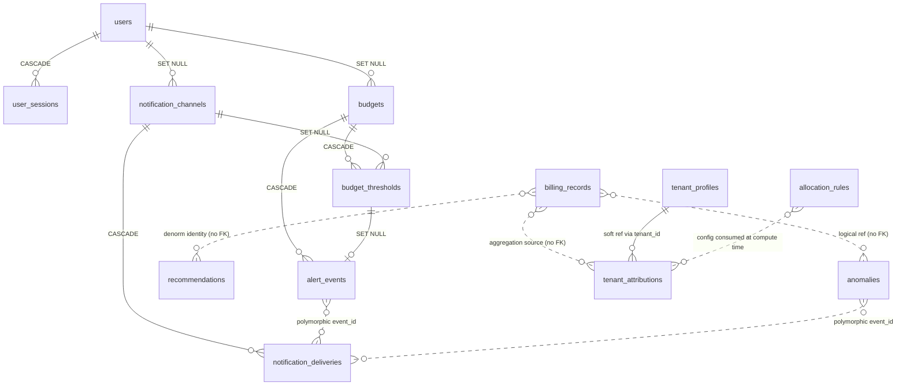
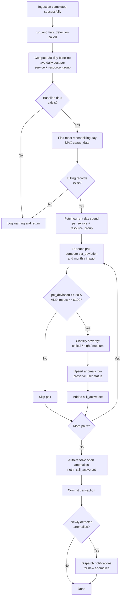
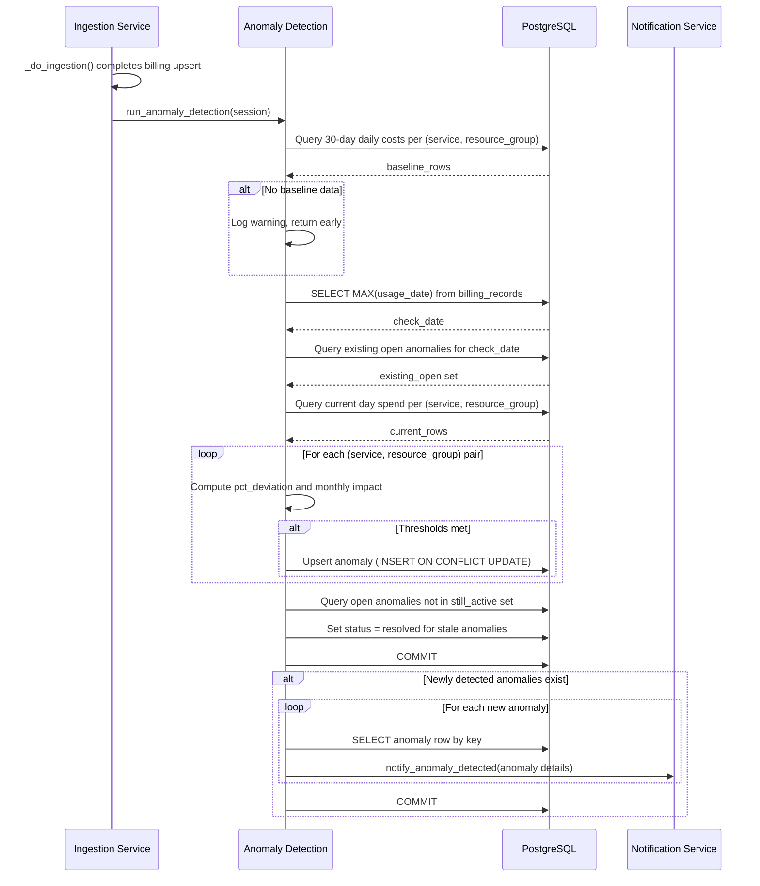
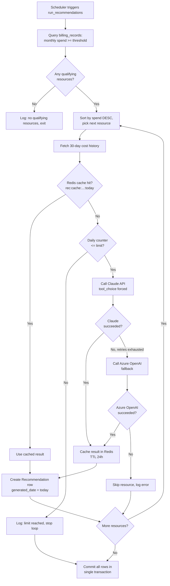
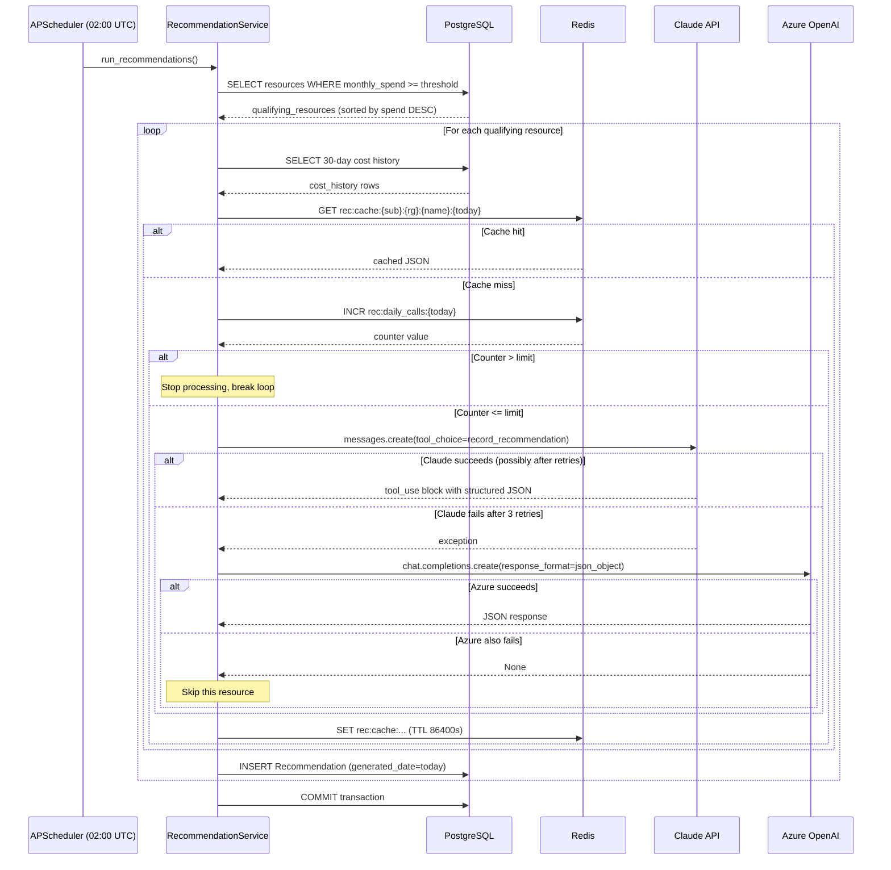
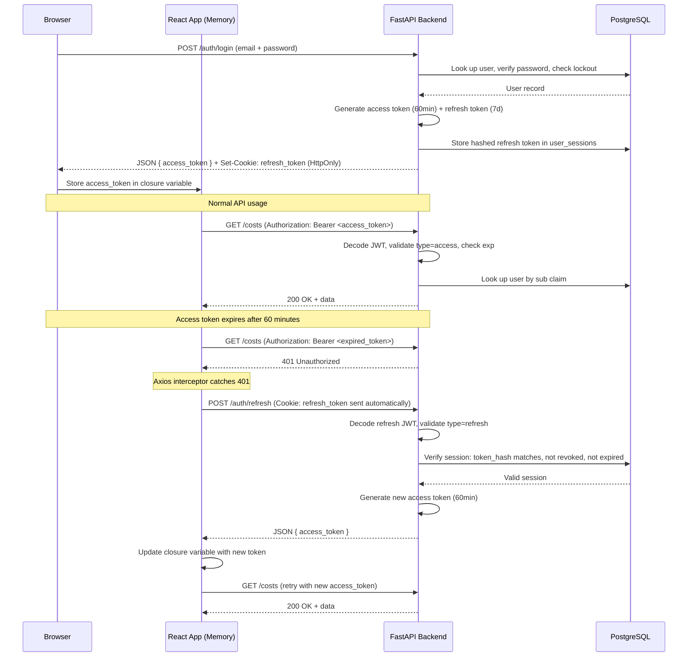
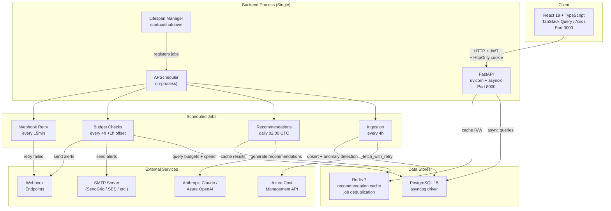

# Presentation Q&A Preparation Guide -- CloudCost

Course: CS 701 -- Special Projects in Computer Science S II
Project: Cloud Infrastructure Cost Optimization Platform
Date: 2026-03-27

This document is a comprehensive Q&A cheat sheet covering the five areas most likely to come up during the presentation. Each section includes deep technical explanations, Mermaid diagrams for visual reference, and pre-answered questions with detailed responses.

**Contents:**
1. [Database Normalization (3NF) and Trade-offs](#database-normalization-3nf-and-trade-offs----qa-cheat-sheet)
2. [Anomaly Detection Algorithm](#anomaly-detection-algorithm----qa-cheat-sheet)
3. [AI Recommendation Pipeline and LLM Fallback Chain](#ai-recommendation-pipeline-and-llm-fallback-chain----qa-document)
4. [Security Implementation and Vulnerability Remediation](#security-implementation-and-vulnerability-remediation----qa-document)
5. [Architecture, DevOps, and Operational Questions](#architecture-devops-and-operational-questions)

**Total pre-answered questions: 30+**

---

# Database Normalization (3NF) and Trade-offs -- Q&A Cheat Sheet

## 1. Normal Form Compliance

### First Normal Form (1NF)

1NF requires that every column holds a single atomic value with no repeating groups, and every table has a primary key. CloudCost satisfies 1NF across all 14 tables: every table has a single-column UUID primary key, and all columns store scalar values -- with three intentional exceptions where JSON/JSONB columns store structured data (`allocation_rules.manual_pct`, `notification_channels.config_json`, and `notification_deliveries.payload_json`), each documented and validated at the application layer.

### Second Normal Form (2NF)

2NF requires that every non-key column is fully functionally dependent on the entire primary key, eliminating partial dependencies that arise from composite keys. CloudCost satisfies 2NF trivially because no table uses a composite primary key -- all primary keys are single-column UUIDs. The one natural composite candidate, `billing_records(usage_date, subscription_id, resource_group, service_name, meter_category)`, is enforced as a `UNIQUE` constraint on a surrogate-keyed row rather than as the PK itself.

### Third Normal Form (3NF)

3NF requires that no non-key column transitively depends on the primary key through another non-key column -- every column must describe a property of the entity identified by the key alone. CloudCost satisfies 3NF with three documented trade-offs where columns are intentionally duplicated or pre-computed for performance or correctness reasons, detailed below.

---

## 2. The Three Denormalization Trade-offs

### Trade-off 1: Point-in-Time Snapshots in `alert_events`

**What was denormalized:** `alert_events.budget_amount` and `alert_events.threshold_percent` duplicate values that live canonically in `budgets.amount_usd` and `budget_thresholds.threshold_percent`.

**Fully-normalized alternative:** Remove `budget_amount` and `threshold_percent` from `alert_events` entirely. To display an alert event, JOIN through `alert_events -> budgets` and `alert_events -> budget_thresholds` to retrieve the current budget amount and threshold percentage.

**Why the trade-off was accepted (correctness):** This is a correctness requirement, not merely a performance optimization. A budget's dollar amount can be edited after an alert fires, and a threshold can be deleted. The alert event must record what the values were at the moment of triggering to serve as an immutable audit record. If the alert read the budget amount via a JOIN, it would show the *current* amount rather than the amount that caused the alert -- producing misleading audit data. This is the classic "point-in-time snapshot" pattern used in financial and compliance systems. The `alert_events` table carries FKs back to `budgets` and `budget_thresholds` (with `SET NULL` on the threshold FK) for navigation, but the snapshot columns are the source of truth for what happened.

### Trade-off 2: Resource Identity Columns in `recommendations`

**What was denormalized:** The `recommendations` table stores five resource identity columns -- `resource_name`, `resource_group`, `subscription_id`, `service_name`, `meter_category` -- that mirror columns in `billing_records` without a foreign key relationship.

**Fully-normalized alternative:** Create a `resources` dimension table with a unique constraint on `(resource_name, resource_group, subscription_id, service_name, meter_category)` and a surrogate UUID PK. Both `billing_records` and `recommendations` would carry a FK to this table. Displaying a recommendation would require a JOIN to `resources` (and potentially through to `billing_records` for current cost).

**Why the trade-off was accepted (performance):** Recommendations are generated once daily by the AI service from a 30-day aggregated view. The dashboard loads the latest batch (`WHERE generated_date = MAX(generated_date)`) on every page view. Joining through a `resources` table and then to `billing_records` -- which can contain millions of rows -- on every dashboard load would be expensive. Because recommendations are fully replaced on each generation cycle (stale rows are retained for history but never shown by default), there is no risk of the denormalized identity drifting out of sync with the current billing data. The `current_monthly_cost` column is also snapshotted at generation time for the same reason.

### Trade-off 3: Pre-computed `top_service_category` in `tenant_attributions`

**What was denormalized:** `tenant_attributions.top_service_category` stores the name of the highest-cost service category for a given tenant in a given month. This value is derivable by querying `billing_records` grouped by `(tenant_id, year, month, service_name)` and selecting the top row.

**Fully-normalized alternative:** Remove `top_service_category` from `tenant_attributions`. Compute it on the fly by joining `tenant_attributions` to `billing_records`, grouping by service name, and ordering by sum of `pre_tax_cost` descending. Alternatively, materialize it in a separate `tenant_attribution_services` table with one row per tenant-month-service combination.

**Why the trade-off was accepted (performance):** The attribution dashboard renders a table with one row per tenant per month, and every row shows the top service category. Computing this from `billing_records` on every page load would require an aggregation query over a large fact table for each tenant-month combination. Storing it inline gives O(1) reads. Staleness is bounded because the value is recomputed on every attribution run (`run_attribution()`), which triggers after each ingestion cycle. The `mom_delta_usd` (month-over-month change) column follows the same pattern -- derivable from adjacent rows but stored for read performance.

---

## 3. Key Table Relationships



---

## 4. Likely Questions and Answers

### Q: "Why didn't you use a composite primary key on `billing_records`?"

**A:** The natural key for a billing record is the 5-column combination `(usage_date, subscription_id, resource_group, service_name, meter_category)`. We enforce this as a `UNIQUE` constraint (`uq_billing_record_key`) but use a surrogate UUID as the PK. There are three reasons. First, a 5-column composite key would need to be duplicated into every FK column on any child table, making JOINs verbose and indexes larger. Second, the ingestion service uses `ON CONFLICT` upsert semantics against the unique constraint -- this works identically whether the constraint is a PK or a UNIQUE. Third, surrogate UUIDs give us a stable, single-column identifier for API responses, URL paths, and cross-service references without exposing the internal composite structure. We get the idempotency guarantee of the natural key via the constraint, with the ergonomic benefits of a surrogate PK.

### Q: "Why is `manual_pct` stored as a JSON column instead of a separate table?"

**A:** The `allocation_rules.manual_pct` column holds a `{tenant_id: percentage}` map that is only populated when `method = 'manual_pct'`. The fully-normalized alternative would be a child table like `allocation_rule_tenant_pcts(rule_id FK, tenant_id, percentage)`. We chose JSON for two reasons. First, the allocation engine evaluates rules in priority order with first-rule-wins semantics -- it needs the complete percentage map for a matched rule in a single row fetch, not scattered across child rows requiring a JOIN. Second, the map is always read and written as a unit (never partially updated), so the relational benefits of a child table (individual row updates, foreign keys to `tenant_profiles`) are not exercised. Validation that percentages sum to 100.0 is enforced by the Pydantic schema at the API boundary before the value reaches the database.

### Q: "How do you prevent stale data in the denormalized columns?"

**A:** Each denormalized column has a bounded staleness window tied to the system's processing cadence. `alert_events.budget_amount` and `alert_events.threshold_percent` are snapshot-at-write and intentionally never updated -- they are correct by design because they record a historical fact. `recommendations` resource identity columns and `current_monthly_cost` are regenerated daily; the UI only shows the latest batch, so stale identity from a prior generation is never displayed. `tenant_attributions.top_service_category` is recomputed on every attribution run, which fires after each ingestion cycle (every 4 hours). In the worst case, `top_service_category` lags the latest billing data by one ingestion interval. There is no background job that silently propagates changes -- instead, the denormalized values are overwritten atomically during each scheduled computation pass, which keeps the consistency model simple and auditable.

### Q: "Why are there no foreign keys between `billing_records` and `recommendations` or `anomalies`?"

**A:** `billing_records` is the central fact table and can contain millions of rows spanning months of history. `recommendations` and `anomalies` are derived outputs: recommendations are generated daily from a 30-day aggregate, and anomalies are detected from rolling statistical baselines. Neither table references a specific billing record row -- they reference resource *groups* and *services*, which are string-valued attributes, not surrogate-keyed entities. Adding a FK would require either (a) creating a `resources` dimension table that both `billing_records` and `recommendations` reference, adding a JOIN on every read path, or (b) pointing each recommendation to a specific `billing_records.id`, which is semantically wrong because a recommendation covers an aggregate of many billing rows across a date range. The soft reference via matching string columns is sufficient because both sides are populated from the same ingestion pipeline, and recommendations are fully regenerated (not incrementally patched), so referential consistency is maintained by the application lifecycle rather than by database constraints.


---


# Anomaly Detection Algorithm -- Q&A Cheat Sheet

## 1. Step-by-Step Algorithm Explanation

### 1.1 Computing the 30-Day Rolling Baseline

The algorithm begins by calculating a baseline average daily cost for each unique `(service_name, resource_group)` pair. It works in two stages:

1. **Daily aggregation**: For each `(service_name, resource_group, usage_date)` combination within the last 30 calendar days, sum all `pre_tax_cost` values from the `billing_records` table. This produces one cost figure per service-resource pair per day.
2. **Averaging**: Take the arithmetic mean of those daily totals across however many days of data exist within the 30-day window. The result is `baseline_avg_daily` -- the expected daily spend for that pair.

The cutoff date is computed as `date.today() - timedelta(days=30)`. Any billing record with `usage_date >= baseline_cutoff` is included.

### 1.2 Deviation Threshold: 20% AND $100/month Minimum Impact

Once the baseline is established, the algorithm fetches the actual spend for the most recent billing day (`MAX(usage_date)` in `billing_records`). For each `(service_name, resource_group)` pair, it computes:

- **Percentage deviation**: `(current_daily - baseline_avg_daily) / baseline_avg_daily * 100`
- **Estimated monthly impact**: `(current_daily - baseline_avg_daily) * 30`

Both conditions must be met to flag an anomaly:

- `pct_deviation >= 20%` -- the spend is at least 20% above the baseline.
- `estimated_monthly_impact >= $100` -- if sustained for a month, the excess would cost at least $100.

If baseline is zero or negative for a pair, that pair is skipped entirely (division by zero guard).

### 1.3 Severity Classification

When both thresholds are met, the anomaly is classified by its estimated monthly impact:

| Estimated Monthly Impact | Severity   |
|--------------------------|------------|
| >= $1,000                | critical   |
| >= $500                  | high       |
| >= $100 (the floor)      | medium     |

There is no "low" severity. The $100 minimum impact threshold means anything below medium never becomes an anomaly in the first place.

### 1.4 Auto-Resolve Logic

After the detection pass, the algorithm queries all open anomalies for the current check date -- those with status `new` or `investigating` and `expected = False`. Any open anomaly whose `(service_name, resource_group)` pair is **not** in the set of still-active anomalies gets its status set to `resolved`. This means: if a spike drops back below thresholds on the next detection run, the anomaly resolves itself without human intervention.

Anomalies that a user has marked as `expected` are excluded from auto-resolution so they remain in their dismissed state.

### 1.5 Idempotent Upsert Behavior

The anomaly table has a unique constraint on `(service_name, resource_group, detected_date)`. The algorithm uses a PostgreSQL `INSERT ... ON CONFLICT DO UPDATE` (upsert) to ensure:

- **First detection**: A new row is created with all metric columns, status defaulting to `new`.
- **Re-detection on the same day**: The metric columns (`baseline_daily_avg`, `current_daily_cost`, `pct_deviation`, `estimated_monthly_impact`, `severity`, `description`) are updated to reflect the latest numbers. Crucially, `status` and `expected` are **never** overwritten, preserving any user actions such as investigating or dismissing the anomaly.

This means re-running detection (e.g., after a second ingestion on the same day) is safe and will not reset user state.

---

## 2. Detection Pipeline Flowchart



---

## 3. Data Flow Sequence Diagram



---

## 4. Likely Questions and Answers

### Q: Why 30 days for the baseline and not 7 or 90?

**A:** Thirty days strikes a balance between responsiveness and stability. A 7-day window is too volatile -- a single unusual week (holidays, a one-off batch job, month-end processing) could dramatically skew the baseline and either mask real anomalies or trigger false alarms on the following week. A 90-day window is too sluggish: legitimate cost increases from scaling events or new service adoption would take three months to be absorbed into the baseline, generating months of stale alerts. Thirty days captures roughly one billing cycle, smooths out weekly patterns (weekday vs. weekend traffic), and adapts within a reasonable timeframe when actual usage changes.

### Q: What happens when there is not 30 days of data?

**A:** The algorithm still runs. The 30-day window is a ceiling, not a minimum. The SQL query uses `WHERE usage_date >= (today - 30 days)`, so if only 10 days of billing data exist, the baseline is computed from those 10 days. The average is taken over however many distinct days are present. The only case where detection is skipped entirely is when the baseline query returns zero rows -- meaning there are no billing records at all in the last 30 days. There is no explicit minimum-days guard, so early in a deployment the baselines may be less stable, which is an accepted trade-off to get anomaly detection running as soon as possible.

### Q: Why require both 20% deviation AND $100 impact?

**A:** The dual threshold eliminates two categories of noise. The percentage threshold alone would flag a service that went from $0.50/day to $0.65/day -- a 30% spike that amounts to $4.50/month and is not worth investigating. The dollar threshold alone would flag a service spending $5,000/day that increased by $4/day to $5,004 -- technically $120/month of excess, but a 0.08% fluctuation that is well within normal variance. Requiring both ensures that only anomalies that are both proportionally significant and financially material generate alerts. This keeps the anomaly list actionable rather than noisy.

### Q: How do you avoid duplicate anomaly alerts?

**A:** Two mechanisms work together. First, the upsert uses a unique constraint on `(service_name, resource_group, detected_date)`. If detection runs twice on the same day (e.g., two ingestion cycles), the second run updates the metric columns but does not create a duplicate row. Second, before dispatching notifications, the algorithm snapshots which `(service_name, resource_group)` pairs already had open anomalies for that date. After the upsert pass, it computes the set difference (`still_active - existing_open`) to identify only the truly new anomalies. Notifications are sent exclusively for that difference set. This means re-running detection never sends duplicate alerts.

### Q: Can users mark false positives?

**A:** Yes. The `mark_anomaly_expected` function sets `expected = True` and `status = "dismissed"` on an anomaly. This has two effects: the anomaly disappears from active counts in the dashboard summary, and -- importantly -- it is excluded from the auto-resolve query (which filters on `expected = False`). If a user changes their mind, `unmark_anomaly_expected` reverses the action by setting `expected = False` and `status = "new"`, returning the anomaly to the active pool. The `expected` flag also feeds into a detection accuracy metric on the dashboard: `(total_detected - expected_count) / total_detected * 100`, giving teams a signal for how often the algorithm flags legitimate issues versus noise.


---


# AI Recommendation Pipeline and LLM Fallback Chain -- Q&A Document

## 1. End-to-End Pipeline Explanation

The recommendation pipeline runs as a daily batch job, triggered by APScheduler at 02:00 UTC or on-demand via an admin API endpoint. The full sequence is as follows.

### Resource Qualification

The pipeline begins by querying the `billing_records` table to find Azure resources whose current-month spend meets or exceeds the configurable `LLM_MIN_MONTHLY_SPEND_THRESHOLD`. Resources are grouped by `(resource_name, resource_group, subscription_id, service_name, meter_category)` and sorted by total spend descending. This ordering guarantees that if the daily call limit is hit partway through the run, the most expensive resources have already been analyzed.

### Redis Cache Check (24-Hour TTL)

For each qualifying resource, the pipeline checks Redis for a cached recommendation under the key `rec:cache:{subscription_id}:{resource_group}:{resource_name}:{today}`. The key incorporates today's date, so cached entries naturally expire at the boundary of a new day and are also explicitly set with a TTL of 86400 seconds (24 hours). A cache hit returns the stored JSON immediately and does not count against the daily LLM call limit.

### Daily Call Counter and Rate Limiting

On a cache miss, the pipeline atomically increments a Redis counter at `rec:daily_calls:{today}` using `INCR`. On the first increment of the day (when the counter transitions from nonexistent to 1), `EXPIREAT` is set to midnight UTC so the counter self-cleans. If the counter exceeds `LLM_DAILY_CALL_LIMIT`, the pipeline stops processing further resources and returns. This provides a hard ceiling on API spend per day.

### Prompt Construction

The prompt fed to the LLM includes the resource's name, type, resource group, subscription, service category, and a line-by-line listing of the last 30 days of daily billed cost. The closing instruction asks for a "specific, actionable cost optimization recommendation."

### Claude API Call with Forced Structured Output

The primary LLM call targets Anthropic Claude (model specified by `ANTHROPIC_MODEL` in settings). The call uses `tool_choice: {"type": "tool", "name": "record_recommendation"}` which forces the model to respond exclusively via the `record_recommendation` tool, guaranteeing structured JSON output that conforms to the tool's `input_schema`. The `max_tokens` budget is 512.

### Retry Logic (Tenacity)

The Anthropic call is wrapped in a Tenacity `@retry` decorator configured for up to 3 attempts with exponential backoff (minimum 2 seconds, maximum 30 seconds). Only transient errors trigger retries: `RateLimitError`, `InternalServerError`, and `APIConnectionError`. Non-transient failures (e.g., `AuthenticationError`, `BadRequestError`) fail immediately without retry.

### Azure OpenAI Fallback

If all three Anthropic attempts fail, the pipeline invokes `_call_azure_openai` as a fallback. This uses the Azure OpenAI service with `response_format: {"type": "json_object"}` and a system prompt that specifies the exact JSON schema. If the Azure credentials (`AZURE_OPENAI_ENDPOINT`, `AZURE_OPENAI_API_KEY`) are not configured, the fallback logs a warning and returns `None` gracefully. Any exception from Azure OpenAI is caught, logged, and also returns `None`.

### Result Storage (Daily Replace Pattern)

Each recommendation is persisted as a `Recommendation` row with `generated_date` set to today. The query endpoint (`get_latest_recommendations`) always selects rows where `generated_date = MAX(generated_date)`. There is no `DELETE` of prior rows. This means the previous day's recommendations remain visible to users until the new batch is fully committed, preventing a "flash of empty state." All new rows are committed in a single transaction at the end of the run.

---

## 2. Decision Tree Flowchart



---

## 3. Sequence Diagram



---

## 4. Structured Output Schema (Tool Definition)

The pipeline forces Claude to produce structured output by defining a tool called `record_recommendation` and setting `tool_choice` to `{"type": "tool", "name": "record_recommendation"}`. This means the model must call this tool rather than responding with free-form text.

The tool's `input_schema` is:

```json
{
  "type": "object",
  "properties": {
    "category": {
      "type": "string",
      "enum": ["right-sizing", "idle", "reserved", "storage"],
      "description": "The optimization category for this resource"
    },
    "explanation": {
      "type": "string",
      "description": "Plain-language explanation of the recommendation (2-4 sentences)"
    },
    "estimated_monthly_savings": {
      "type": "number",
      "description": "Estimated monthly savings in USD if recommendation is applied"
    },
    "confidence_score": {
      "type": "integer",
      "description": "Confidence in this recommendation, 0-100",
      "minimum": 0,
      "maximum": 100
    }
  },
  "required": ["category", "explanation", "estimated_monthly_savings", "confidence_score"]
}
```

Key design choices in this schema:

- **`category` uses an `enum`** to constrain the model to exactly four known optimization types, preventing free-form category invention.
- **`confidence_score` is an integer with min/max bounds**, giving downstream UI components a predictable 0-100 range.
- **All four fields are required**, so partial or malformed responses trigger a parse error rather than silent data gaps.

---

## 5. Likely Questions and Answers

### Q: Why use `tool_choice` instead of just prompting for JSON?

**A:** Prompting for JSON relies on the model's willingness to comply and produces output that must be parsed optimistically. Even with strong prompting, models occasionally wrap JSON in markdown code fences, add preamble text, omit fields, or use unexpected field names. The `tool_choice` parameter with `{"type": "tool", "name": "record_recommendation"}` is a hard constraint enforced by the Anthropic API itself: the model is structurally required to call the specified tool, and the API validates the output against the tool's `input_schema` before returning. This eliminates an entire class of parsing failures and removes the need for fragile regex or JSON-extraction logic on our side. The enum constraint on `category` and the min/max on `confidence_score` are also enforced at the API level, not just hoped for in the prompt.

### Q: What happens if both Claude and Azure OpenAI fail?

**A:** The resource is silently skipped. `_get_or_generate` returns `None`, and the main loop moves on to the next qualifying resource. The daily call counter has already been incremented (the counter counts attempts, not successes), so a failing resource does consume one unit of the daily budget. Critically, there is no crash or transaction rollback -- the pipeline continues processing remaining resources, and all successfully generated recommendations are committed at the end. The previous day's recommendations remain visible to users via the `MAX(generated_date)` query pattern, so users never see an empty state.

### Q: Why cache recommendations for 24 hours?

**A:** The 24-hour cache serves two purposes. First, it prevents redundant LLM calls if the pipeline is triggered multiple times in a day (e.g., an admin manually triggers it after the scheduled 02:00 UTC run). Second, it protects the daily call budget: cache hits do not count against `LLM_DAILY_CALL_LIMIT`, so re-runs are essentially free. The cache key includes today's date, so a new day naturally invalidates prior entries even before the 86400-second TTL expires. This ensures that each day's recommendations are generated from fresh billing data rather than stale cached analysis.

### Q: How do you prevent runaway API costs?

**A:** Multiple layers work together. (1) The `LLM_MIN_MONTHLY_SPEND_THRESHOLD` filter ensures only resources with meaningful spend are analyzed -- low-cost resources are excluded entirely. (2) Resources are sorted by spend descending, so if the limit is hit mid-run, the most impactful resources have already been covered. (3) The `LLM_DAILY_CALL_LIMIT` enforced via a Redis atomic counter provides a hard ceiling on the number of LLM invocations per day. (4) The Redis cache prevents duplicate calls for the same resource within a day. (5) `max_tokens=512` caps the output size per call. (6) The Tenacity retry decorator only retries transient errors (rate limits, server errors, connection errors) -- a malformed request or authentication failure fails fast without burning additional attempts.

### Q: Why daily batch instead of on-demand per-resource recommendations?

**A:** Daily batch processing is a deliberate trade-off favoring cost control and operational simplicity. On-demand generation would require per-request rate limiting, user-facing latency management (LLM calls take 2-10 seconds), and would make API costs unpredictable and proportional to user activity. The batch approach lets us process all qualifying resources in a single scheduled window, apply a single daily budget, and serve recommendations from the database with sub-millisecond latency throughout the day. Cost data changes slowly (billing records are ingested every 4 hours), so recommendations computed at 02:00 UTC remain valid for the rest of the day. The admin endpoint for manual re-trigger exists as a safety valve for cases where new billing data materially changes the picture.


---


# Security Implementation and Vulnerability Remediation -- Q&A Document

**Project:** CloudCost Azure Cloud Cost Optimization Platform
**Prepared:** March 27, 2026

---

## 1. Authentication Architecture

### JWT Access Tokens (60-Minute, In-Memory Only)

When a user logs in, the backend issues a short-lived JWT access token with a 60-minute expiration. This token contains the user's ID and role in its payload, is signed with HS256 using the server's `JWT_SECRET_KEY`, and includes a unique `jti` (JWT ID) claim for traceability. The token is returned in the JSON response body and stored exclusively in a JavaScript closure variable (`_accessToken`) inside the Axios API module. It is never written to `localStorage`, `sessionStorage`, or any other persistent browser storage.

Every outgoing API request attaches the access token via an Axios request interceptor that sets the `Authorization: Bearer <token>` header. On the backend, the `get_current_user` dependency decodes the token, verifies the `type` claim is `"access"`, looks up the user by the `sub` claim, and confirms the account is active before granting access.

### Refresh Tokens (7-Day, HttpOnly Cookie)

Alongside the access token, the login endpoint issues a refresh token with a 7-day expiration. This token is delivered as an `HttpOnly`, `SameSite=Lax` cookie scoped to the `/api/v1/auth` path. The `HttpOnly` flag means JavaScript cannot read, modify, or exfiltrate this cookie -- it is managed entirely by the browser and sent automatically with requests to the auth endpoints. In production, the `Secure` flag is also set, restricting the cookie to HTTPS connections.

On the server side, the refresh token is not stored in plaintext. Instead, its SHA-256 hash is persisted in the `user_sessions` table alongside metadata (IP address, user agent, expiration time, revocation status). When the client calls the `/auth/refresh` endpoint, the server hashes the incoming cookie value, looks up the matching session row, and verifies it is not revoked and has not expired (`expires_at > now`). Only then is a new access token issued.

### Why Tokens Are NOT in localStorage

Storing tokens in `localStorage` or `sessionStorage` exposes them to any JavaScript running on the page. A single XSS vulnerability -- whether from a compromised dependency, an injected script, or a reflected input -- would allow an attacker to read the token and exfiltrate it to an external server. Once stolen, the token can be used from any machine for its full remaining lifetime.

By keeping the access token in a JavaScript closure variable:
- It is inaccessible to XSS attacks that inject `<script>` tags or inline event handlers (they run in a different execution context).
- It is automatically cleared on page refresh, limiting the window of exposure.
- The refresh token, stored in an HttpOnly cookie, is completely invisible to JavaScript and cannot be stolen via XSS at all.

This architecture means that even a successful XSS attack cannot persist stolen credentials beyond the current page session, and the refresh token remains safe regardless.

### Brute-Force Lockout Mechanism

The login endpoint implements a progressive lockout strategy directly in the `User` model. Each failed password attempt increments the `failed_login_attempts` counter on the user record. When this counter reaches 5, the account's `locked_until` field is set to 15 minutes in the future. Subsequent login attempts against a locked account are immediately rejected with HTTP 429 (Too Many Requests) before the password is even checked, preventing timing-based enumeration. On successful login, both `failed_login_attempts` and `locked_until` are reset to zero/null.

---

## 2. The 7 Security Vulnerabilities Found and Fixed

These vulnerabilities were identified during a systematic architecture-level security review conducted on March 14, 2026. Each was triaged, assigned an identifier, and resolved in a single coordinated commit.

### CRIT-05: Webhook HMAC Secret Exposure

**Problem:** The API response schemas for webhook configurations included the HMAC signing secret in plaintext. Any authenticated user who could view webhook settings could see the secret used to sign outbound webhook payloads, enabling them to forge valid webhook signatures.

**Fix:** All API response schemas for webhook objects were updated to redact the secret field. The secret is accepted on create/update but is never returned in any GET response.

### CRIT-06: Dead Brute-Force Lockout Code

**Problem:** The `User` model had `failed_login_attempts` and `locked_until` fields, but the login endpoint never checked or updated them. The brute-force protection existed only as dead schema -- an attacker could make unlimited password guesses without any rate limiting or lockout.

**Fix:** The login endpoint was updated to check `locked_until` before verifying the password, increment `failed_login_attempts` on each failure, trigger a 15-minute lockout after 5 consecutive failures, and reset the counters on successful authentication.

### CRIT-02: Shared Session Corruption in Budget Check Loop

**Problem:** The scheduled budget check task iterated over multiple budgets within a single database session. If one iteration raised an exception and triggered a `session.rollback()`, it corrupted the session state for all subsequent iterations, causing valid budget checks to fail silently.

**Fix:** Replaced the shared session with per-iteration sessions. Each budget check now opens its own `AsyncSession`, ensuring that a failure in one iteration is isolated and does not affect others.

### CRIT-01: Anthropic Client Instantiated Before API Key Guard

**Problem:** The recommendation service instantiated the Anthropic API client at module import time, before the guard that checks whether an API key is configured. In environments where `ANTHROPIC_API_KEY` was unset, the import would raise an unhandled exception, crashing the module entirely rather than gracefully skipping AI features.

**Fix:** Moved the client construction to occur after the API key validation check, so the module loads cleanly regardless of whether AI credentials are configured.

### SEC-02: No Server-Side Refresh Token Expiry Check

**Problem:** The refresh endpoint decoded the JWT and validated its signature but did not check the `expires_at` timestamp stored in the `user_sessions` table. This meant that even if the JWT's own `exp` claim expired, a refresh token could theoretically continue to work if the JWT library was configured leniently or the clock drifted.

**Fix:** Added an explicit `expires_at > datetime.now(UTC)` condition to the database query when validating refresh tokens. The session must be non-revoked AND non-expired at the database level, providing defense-in-depth beyond the JWT's own expiry claim.

### SEC-03: Default JWT Secret Accepted in Production

**Problem:** The JWT secret key had a default development value (`dev-secret-change-in-production`). If an operator deployed to production without setting a real secret, all tokens would be signed with this well-known value, allowing anyone to forge valid JWTs.

**Fix:** Added a startup validator in `config.py` that checks whether `APP_ENV` is `production` and, if so, rejects the default JWT secret with a hard error. The application refuses to start in production mode with an insecure secret.

### API-04: IDOR on Budget Threshold Deletion

**Problem:** The DELETE endpoint for budget alert thresholds accepted a threshold ID but did not verify that the threshold belonged to a budget owned by the requesting user's tenant. An authenticated user could delete thresholds belonging to other tenants by guessing or enumerating IDs (Insecure Direct Object Reference).

**Fix:** Added an ownership verification step that joins the threshold to its parent budget and confirms the budget belongs to the requesting user's tenant before allowing deletion.

---

## 3. JWT Authentication Flow



---

## 4. RBAC Role Hierarchy

```mermaid
graph TD
    subgraph Roles
        ADMIN[admin]
        DEVOPS[devops]
        FINANCE[finance]
        VIEWER[viewer]
    end

    subgraph "Admin-Only Access"
        A1[User management -- create, update, deactivate accounts]
        A2[Tenant management -- create tenants, assign users]
        A3[Webhook configuration -- create, update, delete]
        A4[System settings and scheduler control]
        A5[All permissions of every other role]
    end

    subgraph "DevOps Access"
        D1[Cost data and resource views]
        D2[Anomaly detection and investigation]
        D3[AI-powered recommendations -- view and act]
        D4[Allocation rules -- create, reorder, delete]
        D5[Ingestion status and job monitoring]
    end

    subgraph "Finance Access"
        F1[Cost data and resource views]
        F2[Budget management -- create, update, delete]
        F3[Budget alert thresholds]
        F4[Cost breakdown by tenant and dimension]
        F5[Anomaly views -- read only]
    end

    subgraph "Viewer Access"
        V1[Dashboard -- read-only]
        V2[Cost data -- read-only]
        V3[Anomaly list -- read-only]
        V4[Recommendation list -- read-only]
    end

    ADMIN --> A1
    ADMIN --> A2
    ADMIN --> A3
    ADMIN --> A4
    ADMIN --> A5

    DEVOPS --> D1
    DEVOPS --> D2
    DEVOPS --> D3
    DEVOPS --> D4
    DEVOPS --> D5

    FINANCE --> F1
    FINANCE --> F2
    FINANCE --> F3
    FINANCE --> F4
    FINANCE --> F5

    VIEWER --> V1
    VIEWER --> V2
    VIEWER --> V3
    VIEWER --> V4
```



The `admin` role is the only role enforced with a dedicated FastAPI dependency (`require_admin`). Other role-based access is enforced at the route level by checking `current_user.role` against the permitted set for each endpoint. The `viewer` role is the most restrictive, granting read-only access to dashboards, costs, anomalies, and recommendations with no ability to modify any data.

---

## 5. Likely Questions and Answers

### Q: "Why store access tokens in memory instead of localStorage?"

**A:** The primary reason is XSS resilience. `localStorage` is accessible to any JavaScript running on the page, which means a single cross-site scripting vulnerability -- whether from a malicious npm package, a reflected input, or an injected third-party script -- can silently exfiltrate the token to an attacker-controlled server. Once stolen, the token works from any machine for its remaining lifetime.

By storing the access token in a JavaScript closure variable (a module-scoped `let` in our Axios service module), it is not accessible via `document.cookie`, `window.localStorage`, or any global API. The trade-off is that the token is lost on page refresh, but this is a feature, not a bug: the refresh token cookie (HttpOnly, invisible to JavaScript) seamlessly re-issues a new access token via the `/auth/refresh` endpoint. The user experiences no interruption, but an attacker who achieves XSS cannot persist or extract any credential.

### Q: "What happens when the access token expires mid-session?"

**A:** The user experiences no disruption. The Axios HTTP client has a response interceptor that watches for 401 Unauthorized responses. When a 401 is detected (and the failing request is not itself a login or refresh call), the interceptor automatically sends a POST to `/auth/refresh`. Because the browser includes the HttpOnly refresh token cookie with this request, the backend can validate the session and issue a fresh 60-minute access token. The interceptor stores the new token in memory and transparently retries the original failed request with the updated `Authorization` header. The entire cycle -- 401, refresh, retry -- happens within a single Axios promise chain, so the calling component's `useQuery` or `useMutation` hook sees a normal successful response.

The only scenario where the user is forced to log in again is if the refresh token itself has expired (after 7 days) or has been explicitly revoked (via the logout endpoint).

### Q: "How did you discover these 7 vulnerabilities?"

**A:** They were found through a deliberate architecture-level security review, not through runtime incidents or penetration testing. The review process involved:

1. **Code path tracing:** Walking through each API endpoint from route handler to database query, checking authorization logic, input validation, and error handling at every layer.
2. **Dead code analysis:** Searching for security-relevant model fields (like `failed_login_attempts` and `locked_until`) and verifying they were actually wired into the corresponding business logic. This is how CRIT-06 (dead brute-force code) was found.
3. **Schema output auditing:** Reviewing every Pydantic response schema to ensure no sensitive fields (secrets, hashes, internal IDs) were being serialized to API responses. This caught CRIT-05 (webhook secret exposure).
4. **Session lifecycle review:** Tracing database session creation and teardown in long-running scheduled tasks to find shared-state corruption. This uncovered CRIT-02 (shared session in budget loop).
5. **Configuration safety review:** Checking all security-sensitive configuration values for safe defaults and production guards. This found SEC-03 (default JWT secret accepted in production).
6. **OWASP Top 10 checklist:** Systematically checking for common vulnerability classes like IDOR, broken authentication, and security misconfiguration across all endpoints. This caught API-04 (IDOR on threshold deletion) and SEC-02 (missing server-side token expiry).

### Q: "What is IDOR and why is it dangerous?"

**A:** IDOR stands for Insecure Direct Object Reference. It occurs when an API endpoint accepts an object identifier (such as a database primary key in the URL) and performs an action on that object without verifying that the requesting user has permission to access it.

In our case, the budget threshold deletion endpoint accepted a threshold ID and deleted it without checking whether the threshold belonged to a budget owned by the caller's tenant. An attacker who was authenticated (even as a low-privilege viewer in Tenant A) could send DELETE requests with threshold IDs belonging to Tenant B, silently removing their alert configurations.

IDOR is dangerous because it is trivial to exploit (just change a number in the URL), difficult to detect from logs without specific monitoring, and can affect data integrity and confidentiality across tenant boundaries. The fix is straightforward: before performing any action, join the target object to its parent hierarchy and confirm ownership matches the authenticated user's tenant. In our codebase, the corrected query joins `threshold -> budget -> tenant` and includes a `WHERE budget.tenant_id == current_user.tenant_id` clause.

### Q: "Why Argon2 instead of bcrypt?"

**A:** CloudCost uses the `pwdlib` library's `PasswordHash.recommended()` configuration, which defaults to Argon2id. Argon2id was selected as the winner of the Password Hashing Competition (PHC) in 2015 and is recommended by OWASP as the primary choice for password hashing.

The key advantage of Argon2id over bcrypt is **memory-hardness**. Bcrypt is computationally expensive but uses a fixed, small amount of memory (~4 KB). This makes it vulnerable to massively parallel attacks on GPUs and custom ASICs, which have enormous computational throughput but limited per-core memory. Argon2id allows the developer to specify a memory cost parameter (typically 64 MB or more per hash), meaning each parallel hash attempt must allocate a significant block of RAM. This makes GPU and ASIC attacks economically impractical because the memory cost per core limits parallelism far more than computation alone.

Argon2id specifically combines the best properties of two Argon2 variants: Argon2i (resistance to side-channel attacks during the first pass) and Argon2d (resistance to GPU cracking in subsequent passes). This makes it suitable for server-side password hashing where both threat models apply. Bcrypt remains a reasonable choice and is not considered broken, but Argon2id provides a stronger security margin against modern hardware-based attacks.


---


# Architecture, DevOps, and Operational Questions

## 1. Architecture Decisions

### Why FastAPI over Django or Flask?

FastAPI was chosen for three reasons. First, it provides native async/await support, which is critical because the application makes many concurrent I/O calls -- Azure Cost Management API requests, PostgreSQL queries via asyncpg, Redis cache lookups, SMTP email sends, and outbound webhook HTTP posts. Django's ORM is synchronous by design (Django 4.1+ async views exist but the ORM story is incomplete), and Flask requires third-party extensions (Quart) for async. Second, FastAPI auto-generates OpenAPI documentation from Pydantic type annotations, which gives us interactive API docs at `/api/docs` with zero extra effort. Third, Pydantic v2 schema validation is built into the request/response cycle, so every incoming payload is validated before it reaches business logic and every response conforms to a declared schema. This eliminates an entire class of bugs where the API silently accepts malformed data.

### Why Async SQLAlchemy?

The ingestion pipeline fetches billing records from Azure, upserts them into PostgreSQL, runs anomaly detection, and triggers attribution -- all in sequence within a single run. If any of these steps used synchronous database calls, the event loop would block and prevent the scheduler, health checks, and other API requests from executing. Async SQLAlchemy 2.0 with the asyncpg driver allows database operations to yield back to the event loop during I/O waits. This is especially important because the scheduler (APScheduler) runs in the same process and same event loop as the API server -- a blocking database call during ingestion would freeze the entire application. The `AsyncSessionLocal` factory is used both by FastAPI dependency injection (for request-scoped sessions) and by scheduler jobs (which open their own sessions outside of request context).

### Why APScheduler Instead of Celery?

The application has four scheduled jobs: ingestion (every 4 hours), recommendations (daily at 02:00 UTC), budget threshold checks (every 4 hours with a 1-hour offset), and webhook retries (every 15 minutes). All four are lightweight orchestration tasks -- they issue API calls and database queries but do not perform heavy CPU-bound computation. Celery would require deploying a separate worker process plus a message broker (Redis or RabbitMQ), adding two more infrastructure components to manage. APScheduler runs in-process within the FastAPI application, sharing the same asyncio event loop, which means zero additional deployment complexity. The tradeoff is that the scheduler is single-process and process-local (the `asyncio.Lock` concurrency guard in `ingestion.py` only works within one process), but for the current scale this is acceptable. The scheduler is registered during the FastAPI lifespan context manager and shut down cleanly on application exit.

### Why TanStack Query Instead of Redux?

The frontend's primary data access pattern is fetching server state (billing records, recommendations, anomalies, budgets) and keeping it synchronized with the backend. TanStack Query (React Query) is purpose-built for this: it provides declarative `useQuery` hooks with automatic caching, background refetching, stale-while-revalidate, and cache invalidation on mutations. Redux would require manually writing action creators, reducers, thunks or sagas for every API call, plus hand-managing cache invalidation logic. TanStack Query eliminates all of that boilerplate. The only client-side state the application needs is authentication context (the in-memory access token and user object), which is handled by a simple React context provider -- no global state library required.

---

## 2. Architecture Diagram



---

## 3. DevOps and CI/CD

### Docker Compose Service Dependency Chain

The `docker-compose.yml` defines a strict startup ordering using health checks and completion conditions:

```
db (PostgreSQL 15)         -- healthcheck: pg_isready
  |
  v
redis (Redis 7-alpine)    -- healthcheck: redis-cli ping
  |
  v
migrate                   -- depends_on: db (healthy)
  |                          runs: alembic upgrade head
  |                          restart: on-failure
  v
seed                      -- depends_on: migrate (completed_successfully)
  |                          runs: python -m app.scripts.seed_admin
  |                          creates: admin@cloudcost.local / admin123
  v
api                       -- depends_on: seed (completed_successfully) + redis (healthy)
  |                          runs: uvicorn with --reload
  |                          healthcheck: HTTP GET /api/v1/health
  v
frontend                  -- depends_on: api (started, no health gate)
                             runs: npm run dev -- --host 0.0.0.0
```

Key design decisions in this chain: (1) The migrate service uses `restart: on-failure` so that if PostgreSQL is accepting connections but not yet ready for DDL, the migration retries. (2) The seed service uses `restart: "no"` and depends on `service_completed_successfully` for migrate, ensuring the schema exists before the admin user is inserted. (3) The API depends on seed completing (not just starting), so the admin account is guaranteed to exist before the first request. (4) The frontend has no health gate on the API because Vite's dev server starts independently and the React app handles API unavailability gracefully via TanStack Query retry logic.

### GitHub Actions Pipeline Stages

The CI pipeline (`.github/workflows/test.yml`) runs two independent jobs in parallel on every push to main and every pull request:

**Backend job** (ubuntu-latest + PostgreSQL 15 service container):
1. Checkout code and set up Python 3.12 with pip caching
2. Install production and dev dependencies
3. Run `ruff check` (linting) on `app/`
4. Run `ruff format --check` (formatting verification) on `app/` and `tests/`
5. Run `alembic upgrade head` against the test database
6. Run `pytest tests/ -v --tb=short` with `APP_ENV=testing`

**Frontend job** (ubuntu-latest):
1. Checkout code and set up Node 24 with npm caching
2. Run `npm ci` (clean install from lockfile)
3. Run `npx tsc --noEmit` (TypeScript type checking)
4. Run `npm run build` (production build to verify no build errors)
5. Run `npm run lint` (ESLint)
6. Run `npm run format:check` (Prettier formatting verification)
7. Run `npx vitest run` (unit and integration tests)

Both jobs must pass for a PR to merge. The backend job uses a real PostgreSQL service container (not mocks) for migration and test execution, ensuring schema compatibility is validated in CI.

### What Happens on `docker compose up` (Startup Sequence)

1. PostgreSQL starts and begins accepting connections. Its healthcheck (`pg_isready`) polls every 5 seconds with up to 10 retries.
2. Redis starts in parallel with PostgreSQL. Its healthcheck (`redis-cli ping`) polls every 5 seconds with up to 5 retries.
3. Once PostgreSQL is healthy, the `migrate` container runs `alembic upgrade head`, applying all pending database migrations. If it fails, Docker restarts it (up to the default restart limit).
4. Once migrations complete successfully, the `seed` container runs `python -m app.scripts.seed_admin`, which creates the default admin user (`admin@cloudcost.local` / `admin123`) if it does not already exist. This is idempotent.
5. Once seed completes and Redis is healthy, the `api` container starts uvicorn. During startup, the FastAPI lifespan context manager executes: (a) `recover_stale_runs()` marks any IngestionRun rows left in "running" status as "interrupted" (crash recovery), (b) a Redis client is initialized and stored on `app.state`, (c) four APScheduler jobs are registered (ingestion, recommendations, budget checks, webhook retry), and (d) the scheduler is started.
6. Once the API container is running (no health gate required), the `frontend` container starts the Vite dev server on port 3000.
7. The application is now fully operational. The `MOCK_AZURE=true` environment variable is set by default, so ingestion jobs return synthetic data without requiring real Azure credentials.

---

## 4. Notification System

### HMAC Webhook Signing

Every outbound webhook POST request is signed using HMAC-SHA256 to allow receivers to verify message authenticity and integrity. The process works as follows:

1. The notification service serializes the webhook payload (containing `event_type`, `event_id`, `timestamp`, and `data`) to a JSON string.
2. The channel's stored secret (configured per webhook endpoint) is used as the HMAC key. The JSON body is the message.
3. The HMAC-SHA256 digest is computed: `hmac.new(secret.encode("utf-8"), body.encode("utf-8"), hashlib.sha256).hexdigest()`.
4. The hex digest is sent in the `X-CloudCost-Signature` header with the prefix `sha256=` (e.g., `sha256=a1b2c3...`).
5. The receiving server can recompute the HMAC using its copy of the shared secret and compare it to the header value. If they match, the payload is authentic and unmodified.

If no secret is configured for a webhook channel, the signature header is omitted entirely. This allows non-sensitive integrations (e.g., internal Slack webhooks) to skip verification.

### Email Delivery via SMTP

Email notifications are sent asynchronously using `aiosmtplib`, which is the async equivalent of Python's `smtplib`. The configuration is provider-agnostic: any SMTP server (SendGrid, Amazon SES, Azure Communication Services, Mailgun, or a self-hosted server) works by setting `SMTP_HOST`, `SMTP_PORT`, `SMTP_USER`, `SMTP_PASSWORD`, and `SMTP_FROM` environment variables. STARTTLS is enabled by default (`SMTP_START_TLS=true`) for transport encryption.

Email bodies are rendered from Jinja2 HTML templates stored in `backend/app/templates/email/`. There are three template types: `budget_alert.html`, `anomaly_detected.html`, and `ingestion_failed.html`. Each template receives a context dictionary with event-specific data (budget name, threshold percentage, anomaly severity, etc.) and returns a subject line and HTML body.

If `SMTP_HOST` is not configured, the email send function logs a warning and returns a "failed" status with the reason "SMTP not configured." This allows the application to run in development without an email provider.

### Retry Logic

Failed webhook deliveries are retried automatically by a scheduler job that runs every 15 minutes. The retry logic works as follows:

1. The `retry_failed_deliveries()` function queries the `notification_deliveries` table for rows where `status = "failed"`, `attempt_number < 3`, the associated channel is a webhook (not email), and the channel is still active.
2. For each failed delivery, it re-sends the original stored payload (preserved in `payload_json`) to the webhook URL, re-computing the HMAC signature.
3. A new `NotificationDelivery` row is created with `attempt_number` incremented by one, recording the new status (delivered or failed) and any error message.
4. After 3 total attempts (the original plus two retries), the delivery is no longer retried.

Email retries are explicitly not supported -- the rationale is that SMTP failures are typically configuration errors (wrong credentials, host unreachable) that will not resolve on their own, whereas webhook failures are often transient (network timeouts, temporary 5xx responses from the receiver).

---

## 5. Scalability Considerations

### Single-Process Scheduler Limitation

The most significant scalability constraint is that APScheduler runs in-process, and the ingestion concurrency guard (`_ingestion_lock = asyncio.Lock()`) is a module-level `asyncio.Lock` -- it only prevents concurrent ingestion within a single Python process. If you run two instances of the API server behind a load balancer, each instance has its own independent lock, and both could trigger ingestion simultaneously. This would cause duplicate billing record processing (though the upsert's `ON CONFLICT DO UPDATE` clause prevents duplicate rows, it wastes Azure API quota and doubles compute time). The same applies to all four scheduled jobs: each instance would independently fire every job.

### What Would Change for Multi-Instance Deployment

Scaling beyond a single process would require several changes:

1. **Distributed job scheduling**: Replace APScheduler with a distributed task queue (Celery + Redis/RabbitMQ) or use a distributed lock (Redis `SET NX EX` or PostgreSQL advisory locks) to ensure only one instance runs each scheduled job.

2. **Distributed ingestion lock**: Replace the `asyncio.Lock` with a Redis-based distributed lock (e.g., Redlock algorithm or a simpler `SET key NX EX 3600` pattern). This ensures that only one instance runs ingestion regardless of how many API servers are deployed.

3. **Scheduler extraction**: Move the scheduler out of the API process entirely into a dedicated worker container. The API servers would only handle HTTP requests, and a single scheduler worker would manage all periodic jobs. This is the Celery Beat pattern.

4. **Redis session or sticky sessions**: The in-memory access token design works fine with multiple instances (tokens are stateless JWTs verified by signature). The refresh token is in an HttpOnly cookie and validated against the database, so it already works across instances.

5. **Database connection pooling**: With multiple instances, total database connections multiply. An external connection pooler like PgBouncer would prevent exhausting PostgreSQL's `max_connections`.

6. **Ingestion partitioning**: For 100x more billing records, the ingestion upsert could be partitioned by date range or subscription ID, allowing parallel chunk processing across multiple workers.

---

## 6. Likely Questions and Answers

### Q: "Why FastAPI instead of Django?"

**A:** Django's primary advantage is its batteries-included approach -- admin panel, ORM, authentication, templating. But our application does not serve HTML; it is a pure API backend consumed by a React SPA. FastAPI gives us three things Django does not do well: native async I/O (critical for our concurrent Azure API calls, database queries, and webhook sends), automatic OpenAPI spec generation from type hints (our interactive docs at `/api/docs` cost zero extra code), and Pydantic validation on every request and response (eliminating silent data corruption). Django's async story, even in 4.x, is incomplete -- the ORM's async wrappers still use thread pools internally, and most third-party Django packages assume synchronous execution. We would have fought the framework rather than leveraged it.

### Q: "How does the scheduler work and what are its limitations?"

**A:** APScheduler runs inside the FastAPI process, registered during the lifespan startup. It manages four jobs: ingestion every 4 hours, AI recommendations daily at 02:00 UTC, budget checks every 4 hours offset by one hour after ingestion, and webhook retries every 15 minutes. The offset between ingestion and budget checks is intentional -- billing data must be current before we evaluate whether spend exceeds budget thresholds. The main limitation is that the scheduler is process-local. If we scale to multiple API instances, each would independently run all four jobs. The ingestion upsert is idempotent (PostgreSQL `ON CONFLICT DO UPDATE`), so duplicate runs do not corrupt data, but they waste Azure API quota and compute. For multi-instance deployment, we would extract the scheduler into a dedicated worker or use distributed locks in Redis.

### Q: "What happens if the ingestion job fails midway?"

**A:** The failure handling has multiple layers. First, the `_do_ingestion` function catches all exceptions. On failure, it opens a fresh database session (separate from the one that may have failed) and writes three things: (1) an `IngestionRun` row with `status="failed"` and the error detail, (2) an `IngestionAlert` row with `is_active=True`, and (3) notification dispatches to all active channels (email and webhook) informing operators of the failure. Second, any billing records that were successfully upserted before the failure are already committed (the upsert commits per batch), so partial progress is preserved. Third, on the next application startup, `recover_stale_runs()` marks any runs left in "running" status as "interrupted," preventing stale state from blocking future runs. Fourth, the next scheduled ingestion run will compute a new delta window starting from the last successful run's end time (with a 24-hour overlap), so it automatically catches up on missed data.

### Q: "How would you scale this to handle 100x more billing records?"

**A:** Several changes would be needed. First, the ingestion upsert currently processes all records in a single batch `INSERT ... ON CONFLICT`. At 100x volume, we would chunk the upsert into batches of 5,000-10,000 rows to avoid holding long database transactions and to provide progress visibility. Second, the anomaly detection currently runs inline after ingestion; at scale, it would be offloaded to an async task queue (Celery) so that ingestion completion is not blocked by anomaly computation. Third, the `billing_records` table would need partitioning by `usage_date` (PostgreSQL native range partitioning), which dramatically improves query performance for date-range aggregations and allows dropping old partitions efficiently. Fourth, the Azure Cost Management API has rate limits (12 QPU per 10-second window), so we would need multiple subscription scopes or the Export API (which delivers CSV files to Azure Blob Storage instead of paginated REST calls). Fifth, the database would need read replicas for the dashboard query load, keeping the primary for writes.

### Q: "Why not use a message queue like RabbitMQ?"

**A:** A message queue adds operational complexity: another service to deploy, monitor, and handle failures for. Our workload does not need one yet. The four scheduled jobs are all I/O-bound orchestration tasks -- they make API calls and database queries but do not perform CPU-heavy work that would benefit from being distributed across workers. The webhook retry logic is simple enough to run as a scheduled query against the database. The notification fan-out iterates over active channels in a loop, which is sufficient for the expected tens of channels, not thousands. If we needed to process millions of events per hour, fan out to hundreds of webhook endpoints, or distribute CPU-bound work like large-scale anomaly model training, a message queue would become necessary. At that point we would adopt Celery with Redis as the broker (since Redis is already deployed) rather than adding RabbitMQ as a new dependency.

### Q: "What would you change if starting over?"

**A:** Three things. First, the scheduler should have been a separate process from day one. Coupling it into the API process seemed convenient but creates the scaling bottleneck described above. A standalone scheduler worker (even using APScheduler, just in its own container) would have been cleaner. Second, the ingestion concurrency guard should use a Redis distributed lock instead of an `asyncio.Lock`, even for single-instance deployment -- it costs almost nothing to implement and future-proofs the design. Third, the notification delivery table stores the full webhook payload as JSON, which is good for retries, but we lack a dead-letter mechanism. After 3 failed attempts, a delivery is silently abandoned. Adding a "dead_letter" status and an admin UI to inspect and manually retry permanently-failed deliveries would improve operational visibility.

### Q: "How do you ensure data consistency between ingestion and anomaly detection?"

**A:** Anomaly detection runs synchronously within the same ingestion function call (`_do_ingestion`), immediately after the billing records are upserted and committed to the database. This is a deliberate design choice: `run_anomaly_detection(session)` operates on the same database session and sees the freshly committed billing data. There is no eventual consistency gap -- anomalies are detected against the exact dataset that was just ingested. The cost of this approach is that ingestion takes longer (it blocks until anomaly detection completes), but it guarantees that anomaly alerts reference billing data that actually exists in the database. If anomaly detection were decoupled into a separate job, there would be a window where users could see new billing data without corresponding anomaly analysis, which could be misleading for finance users relying on anomaly alerts for budget governance.

### Q: "What is the startup sequence and why does order matter?"

**A:** The startup sequence is: PostgreSQL, then Redis (in parallel with Postgres), then Alembic migrations, then admin user seeding, then the API server, then the frontend. Order matters at every step. Migrations must run before the API starts because SQLAlchemy async sessions will fail on missing tables or columns -- there is no lazy migration. Seeding must run after migrations because it inserts into the `users` table, which must exist. The API must start after seeding because the lifespan manager calls `recover_stale_runs()`, which queries the `ingestion_runs` table. Redis must be healthy before the API starts because the lifespan manager initializes a Redis client and registers it on `app.state`; if Redis is unavailable, the recommendation caching and job deduplication will fail. The frontend can start before the API is fully healthy because the Vite dev server is independent and the React app handles API errors gracefully with TanStack Query's built-in retry and error state management. Docker Compose enforces this ordering through `healthcheck` conditions and `depends_on` with `service_healthy` and `service_completed_successfully` constraints.
